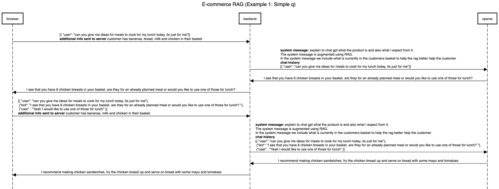
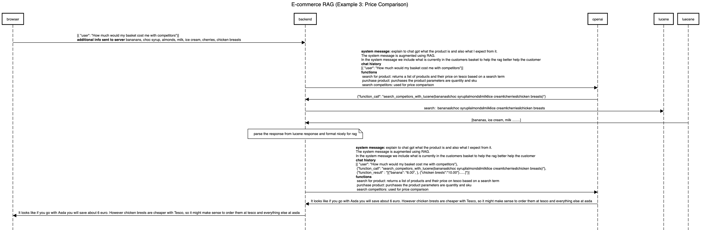

# 🧞‍♂️ GourmetGenie

GourmetGenie is a Chrome extension that acts as your personal AI shopping assistant on the Tesco website. Whether you're planning meals for the week, looking for dinner inspiration, or just need help filling up your basket, GourmetGenie has you covered.

## ✨ Features
### 🛒 Smart Basket Integration
Gourmet Genie always knows what's in your basket and intelligently suggests ways to reuse leftovers from your previous orders.

### 💬 AI-Powered Meal Suggestions
Chat with GourmetGenie to get personalized meal ideas and product recommendations.

### ⚡ Zero-Click Ordering
Let the Genie add suggested or requested items straight to your Tesco basket.

### 📆 Weekly Planning Made Easy
Ask for help planning your meals for the week and instantly get the ingredients added.

## 🧠 How It Works
The extension interacts directly with the Tesco web interface. It reads your current basket and suggests meals or ingredients through a conversational interface powered by AI. You can ask things like:

“What should I eat this week?”

“Add ingredients for spaghetti carbonara.”

“What can I cook with chicken and mushrooms?”

It then finds the best matches and adds them to your Tesco basket.

## 🛠 Tech Stack
JavaScript/TypeScript

Chrome Extension APIs

LLM-powered Chat UI

Tesco website DOM integration

## Scenario 1 

## Scenario 2

## Scenario 3

